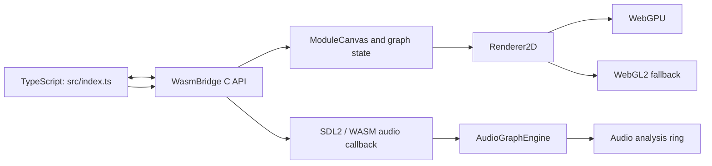

# WASM architecture

The browser port owns its own runtime and supports a deliberately smaller module set than desktop.

- `src/index.ts` loads the Emscripten module, selects a renderer, and forwards browser input.
- `wasm/src/WasmBridge.cpp` is the C ABI and owns runtime initialization.
- `ModuleCanvas` owns the portable module graph and patch-state representation.
- `WasmModuleAdapter` (`wasm/include/BespokeWasm/WasmModuleAdapter.h`) is the per-module boundary between canvas UI, serialization, and `AudioGraphEngine` processing. `FilterModuleAdapter` is the first end-to-end adapter using `Source/BiquadFilter`.
- `Renderer2D` keeps WebGPU and WebGL2 drawing paths interchangeable.
- `AudioGraphEngine` processes the supported graph subset; do not assume desktop audio modules are present.

## Module canvas file layout

| File | Responsibility |
|------|----------------|
| `wasm/include/BespokeWasm/ModuleCanvas.h` | Canvas API, patch snapshots |
| `wasm/include/BespokeWasm/AudioGraphTypes.h` | Lock-free audio graph POD types |
| `wasm/include/BespokeWasm/WasmModuleAdapter.h` | Adapter interface + registry |
| `wasm/include/BespokeWasm/adapters/FilterModuleAdapter.h` | Filter adapter (DSP + metadata) |
| `wasm/include/BespokeWasm/modules/WasmModules.h` | Concrete canvas module classes |
| `wasm/src/ModuleCanvas.cpp` | CRUD, graph snapshot publish, state apply |
| `wasm/src/ModuleCanvasRender.cpp` | Canvas + spawn menu rendering |
| `wasm/src/ModuleCanvasInput.cpp` | Mouse/keyboard interaction |
| `wasm/src/ModuleCanvasHelpers.cpp` | Shared text/layout helpers |
| `wasm/src/Module.cpp` | Base `Module` UI chrome |
| `wasm/src/modules/*.cpp` | Per-type canvas UI implementations |
| `wasm/src/WasmModuleAdapterRegistry.cpp` | Built-in adapter registration |
| `wasm/src/ModuleFactory.cpp` | Thin wrapper over adapter registry |

For desktop architecture, see [`docs/DEVELOPER_CONTEXT.md`](../DEVELOPER_CONTEXT.md). For WASM-specific decisions, this directory is canonical.
