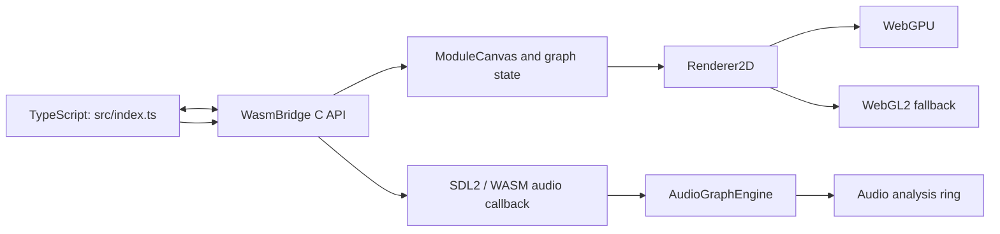

# WASM architecture

The browser port owns its own runtime and supports a deliberately smaller module set than desktop.

- `src/index.ts` loads the Emscripten module, selects a renderer, and forwards browser input.
- `wasm/src/WasmBridge.cpp` is the C ABI and owns runtime initialization.
- `ModuleCanvas` owns the portable module graph and patch-state representation.
- `Renderer2D` keeps WebGPU and WebGL2 drawing paths interchangeable.
- `AudioGraphEngine` processes the supported graph subset; do not assume desktop audio modules are present.

For desktop architecture, see [`docs/DEVELOPER_CONTEXT.md`](../DEVELOPER_CONTEXT.md). For WASM-specific decisions, this directory is canonical.
